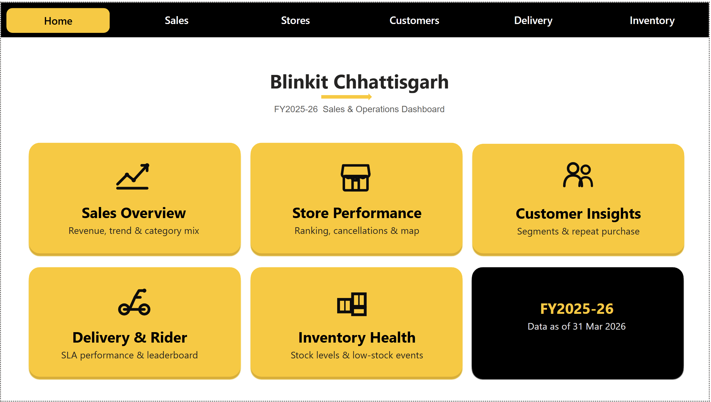
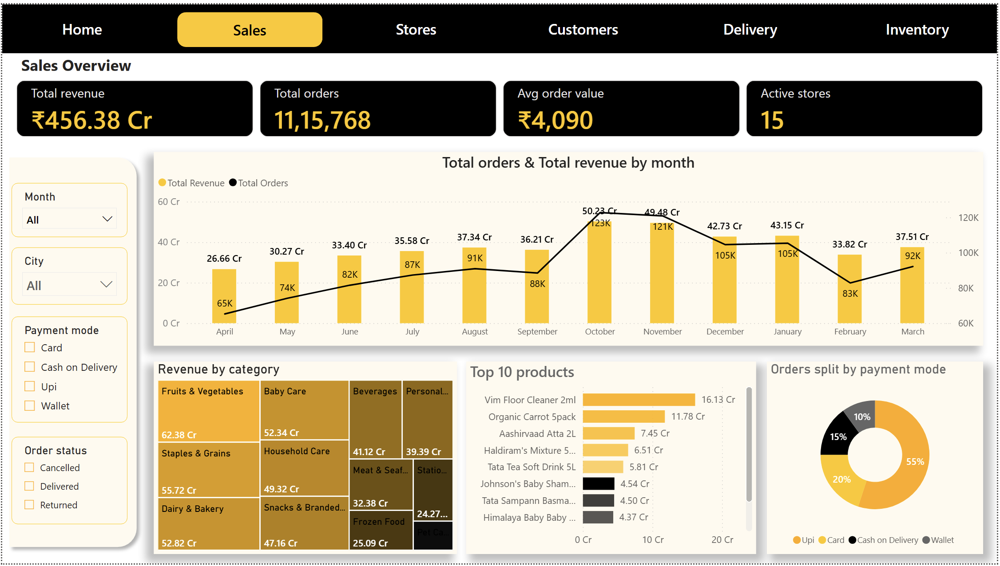
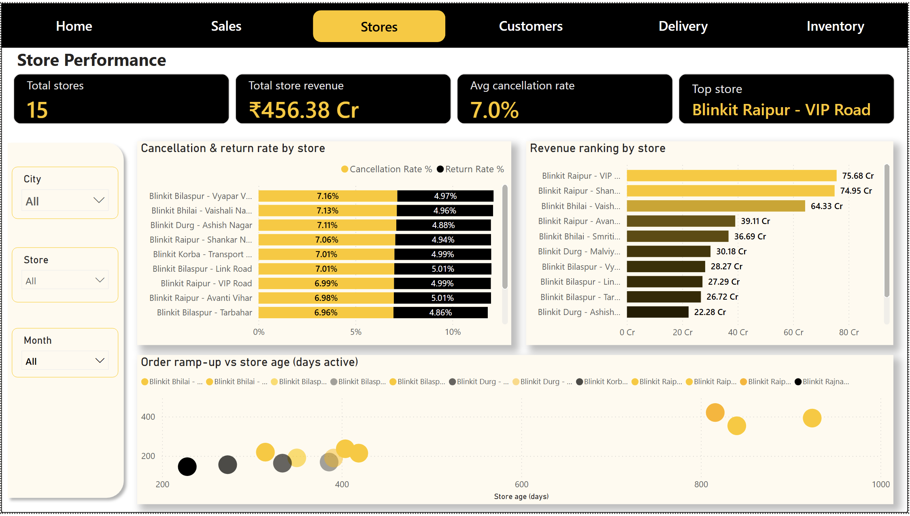
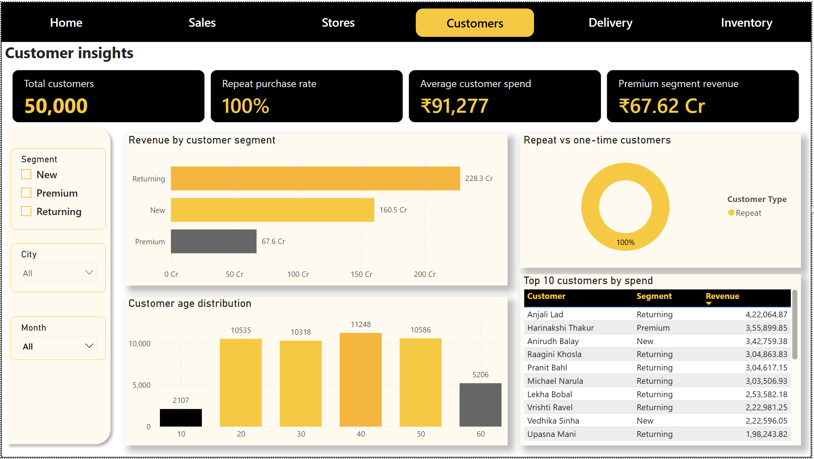
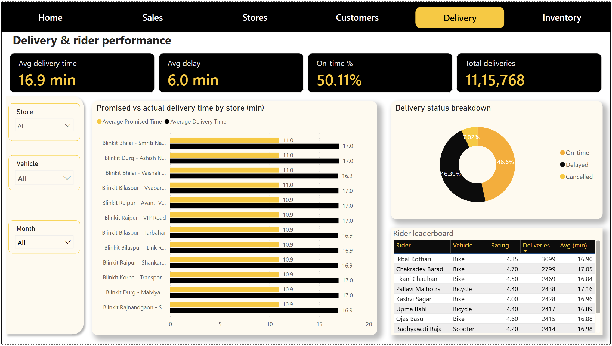
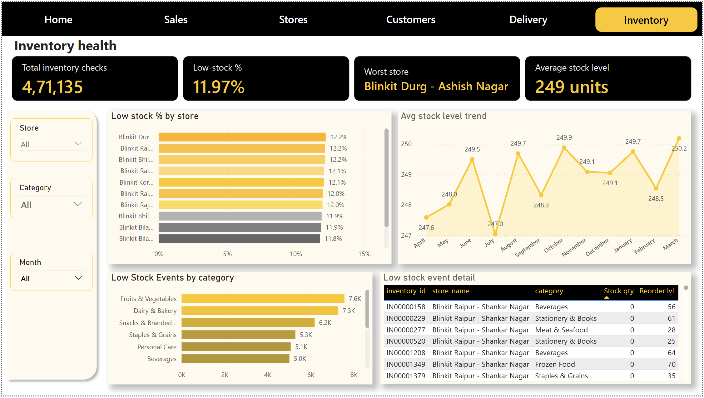

# Blinkit Chhattisgarh — Sales & Operations Analytics Platform (FY2025-26)


An end-to-end data analytics project simulating Blinkit's quick-commerce operations across
Chhattisgarh for fiscal year 2025-26 — built on a **medallion architecture** (Bronze → Silver →
Gold) using Python, pandas, and MySQL, with the analysis layer delivered through SQL business
questions and a six-page Power BI dashboard.

---

## Problem statement

Quick-commerce operators run on thin margins and tight delivery SLAs, where decisions on store
expansion, rider allocation, and inventory stocking depend on clean, queryable operational data.
This project builds that data foundation from the ground up — starting from realistically messy
raw data (missing values, duplicates, inconsistent formatting, referential integrity breaks) and
producing a trustworthy, analysis-ready warehouse capable of answering concrete business
questions around sales trends, store performance, delivery SLAs, customer behavior, and
inventory health, visualized in an interactive multi-page dashboard.

---

## Dashboard preview

| Home | Sales Overview |
|---|---|
|  |  |

| Store Performance | Customer Insights |
|---|---|
|  |  |

| Delivery & Rider Performance | Inventory Health |
|---|---|
|  |  |


---

## Architecture

```
                 ┌─────────────────┐      ┌──────────────────┐      ┌─────────────────┐
   Raw CSVs  ──▶ │  blinkit_bronze │ ──▶  │  blinkit_silver  │ ──▶  │   blinkit_gold   │
                 │  (untouched,    │      │  (cleaned,       │      │  (star schema,   │
                 │   raw import)   │      │   correctly      │      │   PK/FK          │
                 │                 │      │   typed)         │      │   enforced)      │
                 └─────────────────┘      └──────────────────┘      └─────────────────┘
                                                                              │
                                                                              ▼
                                                                  SQL business questions
                                                                              │
                                                                              ▼
                                                                  Power BI dashboard
                                                                  (6 pages, CSV import)
```

- **Bronze**: raw CSVs loaded as-is into MySQL, no transformations — the permanent, immutable
  source of truth.
- **Silver**: cleaned and correctly typed — nulls resolved (imputed or re-derived, not just
  dropped), duplicates removed on the correct business key, referential integrity breaks
  quarantined, mixed date/time formats parsed explicitly, outliers identified against fixed
  business thresholds rather than blanket percentile cuts, column types corrected from generic
  `TEXT`/`DOUBLE`/`DATETIME` to proper `VARCHAR`/`INT`/`DECIMAL`/`DATE`.
- **Gold**: reshaped into a star schema (5 dimension tables, 4 fact tables) with explicit primary
  and foreign key constraints, exported to CSV and imported directly into Power BI.
- **Dashboard**: six pages (Home, Sales Overview, Store Performance, Customer Insights,
  Delivery & Rider Performance, Inventory Health) with cross-page navigation, KPI cards in
  Indian currency format (Crore/Lakh), and slicers on every analytical page.

---

## Dataset

A large-scale synthetic dataset modeling Blinkit's Chhattisgarh operations (Raipur, Bhilai,
Bilaspur, Durg, Korba, Rajnandgaon) across FY2025-26, including realistic store ramp-up
(newer stores launching mid-year) and seasonal demand patterns (festive-season spikes in
October–November, clearly visible in the Sales Overview trend).

| Table | Rows |
|---|---|
| stores | 15 |
| riders | 800 |
| customers | 50,000 |
| products | 6,000 |
| orders | 1,203,600 (1,115,768 non-cancelled) |
| order_items | ~4,495,500 |
| deliveries | 1,200,000 |
| inventory snapshots | 471,135 |

The raw data was deliberately generated with realistic data-quality problems — missing values,
duplicate records, inconsistent text casing, mixed date formats, sign errors, referential
integrity breaks, and outliers — so the cleaning phase reflects the kind of work a real-world
data pipeline actually requires, not just a happy-path ETL.

---

## Tech stack

- **Python**: pandas, NumPy, SQLAlchemy, PyMySQL
- **MySQL 8.0**: storage layer across all three medallion stages
- **SQL**: business-question queries, schema constraints, `ALTER`-based type correction
- **Jupyter Notebook**: pipeline development and documentation
- **Power BI Desktop**: six-page interactive dashboard, DAX measures, CSV-based data model

---

## Project structure

| File | Purpose |
|---|---|
| `01_bronze_data_import.ipynb` | Loads raw CSVs into `blinkit_bronze`, untouched |
| `01_silver_data_import.sql` | Copy raw data from `blinkit_bronze` to `blinkit_silver` , as-is |
| `01_silver_initial_data_exploration.ipynb` | Broad first-pass profiling of every table |
| `02_silver_data_transformation_findings.ipynb` | Deep-dive audit — documents every specific issue found per table before any fix is applied |
| `03_silver_data_cleaning.ipynb` | Fixes every issue identified in `02`, writes cleaned data back to `blinkit_silver` |
| `silver_restructuring.sql` |  corrects column types in `blinkit_silver` (`TEXT`/`DOUBLE`/`DATETIME` → proper `VARCHAR`/`INT`/`DECIMAL`/`DATE`) |
| `04_gold_layer_build.ipynb` | Builds the `blinkit_gold` star schema (dimensions + facts) from cleaned Silver data |
| `03_gold.sql` | Creates `blinkit_gold` and adds primary/foreign key constraints across the star schema |
| `04_gold_business_questions.sql` | 13 SQL queries answering concrete business questions against `blinkit_gold` |
| `05_gold_tables_export_csv.ipynb` | (Optional) Exports all 9 Gold tables to CSV for direct import into Power BI, you can build connection directly in power bi and MySQL |
| `blinkit_sales_analysis_dashboard.pbix` | The Power BI dashboard file |

---

## Data quality issues handled

- Missing values — imputed where derivable (e.g. `selling_price` re-derived from `mrp` and
  `discount_pct`), left as `NULL` with a flag where not (e.g. unassigned `rider_id`)
- Duplicate records — deduplicated on the correct business key (`order_id`, `customer_id`), not
  naive full-row matching, which under-counts duplicates whose other fields drifted after the
  duplicate was created
- Inconsistent text formatting — casing and whitespace standardized across categorical columns
- Mixed date formats — parsed explicitly per format rather than relying on automatic inference,
  which can silently swap day/month on some rows
- Referential integrity breaks — order line items referencing non-existent products identified
  and quarantined rather than silently kept or dropped
- Sign errors — negative quantities and stock levels corrected
- Outliers — identified against fixed, domain-appropriate thresholds (e.g. delivery time > 100
  minutes) rather than statistical percentile cutoffs, which would also clip genuinely slow (but
  real) deliveries
- Legitimate nulls preserved — e.g. delivery time is correctly `NULL` for cancelled orders; this
  was distinguished from genuinely missing data rather than imputed away
- Generic MySQL column types (`TEXT`/`DOUBLE`/`DATETIME` from pandas auto-inference) corrected to
  proper `VARCHAR`/`INT`/`DECIMAL`/`DATE` for indexing, storage efficiency, and floating-point
  precision on currency fields

---

## Key insights

Sales
FY2025-26 closed at ₹456.38 Cr in revenue across 11,15,768 orders (avg order value
₹4,090), spread over 15 active stores. Revenue grew steadily from ₹26.66 Cr in April to a
clear festive-season peak in October (₹50.23 Cr, 1.23L orders), sustained into November
(₹49.48 Cr) before cooling into the winter months — a ~90% jump from the April baseline to the
October peak, and the clearest seasonal signal in the dataset. Fruits & Vegetables led every
category at ₹62.38 Cr, ahead of Staples & Grains (₹55.72 Cr) and Dairy & Bakery (₹52.82 Cr).
UPI dominates payments at 55% of all orders, more than Card, Cash on Delivery, and Wallet
combined.

Stores
Performance is heavily concentrated at the top: Blinkit Raipur – VIP Road (₹75.68 Cr) and
Raipur – Shankar Nagar (₹74.95 Cr) together generate more revenue than the bottom seven
stores combined, and the three Raipur stores alone account for roughly 40% of total company
revenue. Despite that revenue spread, cancellation rates are remarkably uniform across every
store (6.96%–7.16%) — a tight ~0.2-point band — indicating cancellation behavior is a
store-independent, systemic pattern rather than a location-specific operational problem. The
ramp-up view confirms the obvious but important pattern: stores live longest (800+ days, the
original Raipur launches) show the highest orders/day, while newer stores are still climbing —
store age, not city, is the strongest predictor of daily order volume.

Customers
The customer base splits into three segments by revenue: Returning customers drive ₹228.3 Cr
(exceeding New and Premium combined), New customers contribute ₹160.5 Cr, and Premium — the
smallest segment — still delivers ₹67.62 Cr. The repeat purchase rate sits at 100% at this
data volume (averaging ~22 orders per customer across 50,000 customers), meaning virtually every
customer in the dataset returns at least once — a genuinely different retention profile than a
typical one-and-done e-commerce business. Customers aged 30–49 are the largest cohort (order-bin
counts of ~10,300–11,200), tapering off sharply past 60.

Delivery & Riders
This is the sharpest operational finding in the dashboard: on-time delivery sits at just
50.11%, with deliveries running a consistent ~6-minute delay over the promised time (10.9–11.0
min promised vs. 16.9–17.0 min actual) — and this gap is nearly identical across every single
store, meaning it's a fleet-wide SLA issue, not a handful of underperforming locations. The
delivery status split (46.6% on-time, 46.39% delayed, 7.02% cancelled) reinforces that roughly
half of all deliveries miss their promised window. On the rider side, top performers like Ikbal
Kothari (3,099 deliveries) and Chakradev Barad (2,799 deliveries) handle meaningfully more
volume than the rest of the leaderboard, suggesting an uneven workload distribution worth
investigating.

Inventory
Stockouts hover in a tight 11.8%–12.2% band across all stores, with Blinkit Durg – Ashish
Nagar the single worst performer — but the narrow spread suggests this is closer to a
structural reorder-threshold issue than a store-specific failure. Fruits & Vegetables has the
most low-stock events (7.6K), consistent with it also being the top-selling category — high
turnover categories are, unsurprisingly, the hardest to keep stocked. The average stock level
trend is fairly flat (247–250 units) with a visible dip in July, but the swings are small enough
that this reads as noise rather than a seasonal inventory pattern.

Overall
The standout tension in this dataset is between a healthy, growing top-line (steady MoM growth,
a strong festive peak, high customer retention) and a fragile fulfillment layer underneath it —
a coin-flip on-time rate and a consistent 6-minute SLA miss across the entire fleet. If this were
a real business, the fastest lever to pull isn't more marketing or more SKUs — it's fixing
delivery promise-setting or rider capacity, since half of all customers are currently experiencing
a late delivery regardless of which store served them.

---

## Business questions answered (`gold_business_questions.sql`)

1. Monthly revenue trend across FY2025-26
2. Store performance ranking by revenue
3. Cancellation and return rate by store
4. Top 10 products by revenue
5. Revenue and quantity by product category
6. Payment mode distribution
7. Revenue split across customer segments
8. Customer repeat-purchase rate
9. Delivery performance by store (promised vs. actual time)
10. Rider performance leaderboard
11. Inventory stockout/low-stock frequency by store
12. Weekday vs. weekend order pattern
13. Store ramp-up — order volume relative to days since opening

---

## Dashboard

Six pages, navigable via a persistent top nav bar (built with Power BI's Page Navigator visual):

- **Home** — landing page with navigation tiles to every section
- **Sales Overview** — revenue/order trend, category and product mix, payment mode split
- **Store Performance** — revenue ranking, cancellation/return rates, store map, ramp-up analysis
- **Customer Insights** — segment revenue split, repeat-purchase behavior, age distribution, top spenders
- **Delivery & Rider Performance** — SLA tracking (promised vs. actual), rider leaderboard, delay analysis
- **Inventory Health** — stockout frequency by store/category, stock level trend, low-stock event detail

All currency KPIs are formatted in Indian numbering (Crore/Lakh) via custom DAX measures rather
than Power BI's default Western number formatting.

---

## How to run

1. Create three MySQL databases: `blinkit_bronze`, `blinkit_silver`, `blinkit_gold`.
2. Run `01_bronze_data_import.ipynb` to load the raw CSVs into `blinkit_bronze`.
3. Run `01_silver_initial_data_exploration.ipynb` and
   `02_silver_data_transformation_findings.ipynb` to audit the data.
4. Run `03_silver_data_cleaning.ipynb` to clean it and write the result to `blinkit_silver`.
5. Run `silver.sql` against `blinkit_silver` to correct column types.
6. Run `04_gold_layer_build.ipynb` to build the `blinkit_gold` star schema.
7. Run `gold.sql` against `blinkit_gold` to add PK/FK constraints.
8. Run the queries in `gold_business_questions.sql` against `blinkit_gold` to validate the layer.
9. Run `05_gold_tables_export_csv.ipynb` to export Gold tables to CSV.
10. Open `Blinkit_CG_Dashboard.pbix` in Power BI Desktop, or re-import the CSVs and rebuild the
    data model relationships (see the dashboard section above) if starting from scratch.

Update the MySQL connection credentials (`DB_USER`, `DB_PASSWORD`, `DB_HOST`) at the top of each
notebook before running.

---

## Known issues / next improvements

- A small number of stores share identical names (e.g. two different stores both named
  "Shankar Nagar") due to the synthetic data generation — resolved in the dashboard by referencing
  `store_id` alongside `store_name` where ambiguity matters.
- Repeat purchase rate currently computes as 100% at this data volume (~22 orders/customer on
  average) — verified against the underlying query rather than assumed.
- Planned: a written project report (PDF) summarizing findings, methodology, and recommendations.
- Planned: a slide deck for presenting the project.

---

## Author

**Sadhan Mistry**
B.Tech CSE | Data Analyst / Business Analyst

- LinkedIn: [linkedin.com/in/sadhanmistry](https://linkedin.com/in/sadhanmistry)
- GitHub: [github.com/sadhanmistry](https://github.com/sadhanmistry)
- Email: sadhanmistry.dev@gmail.com
